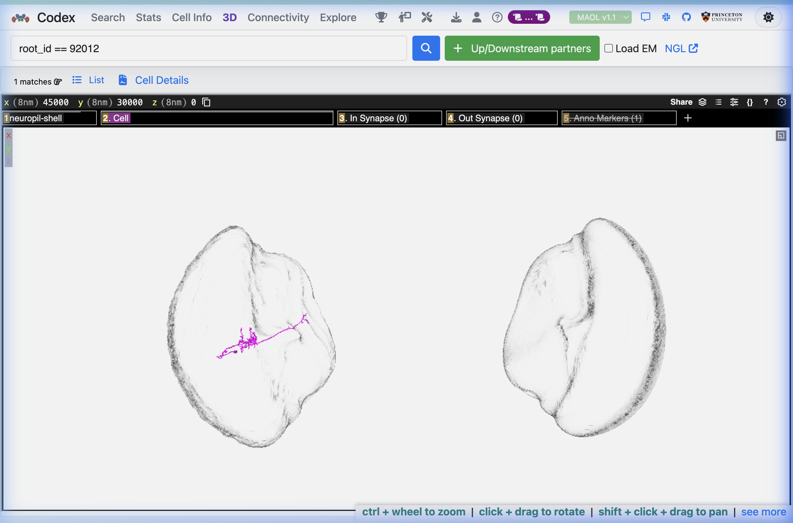
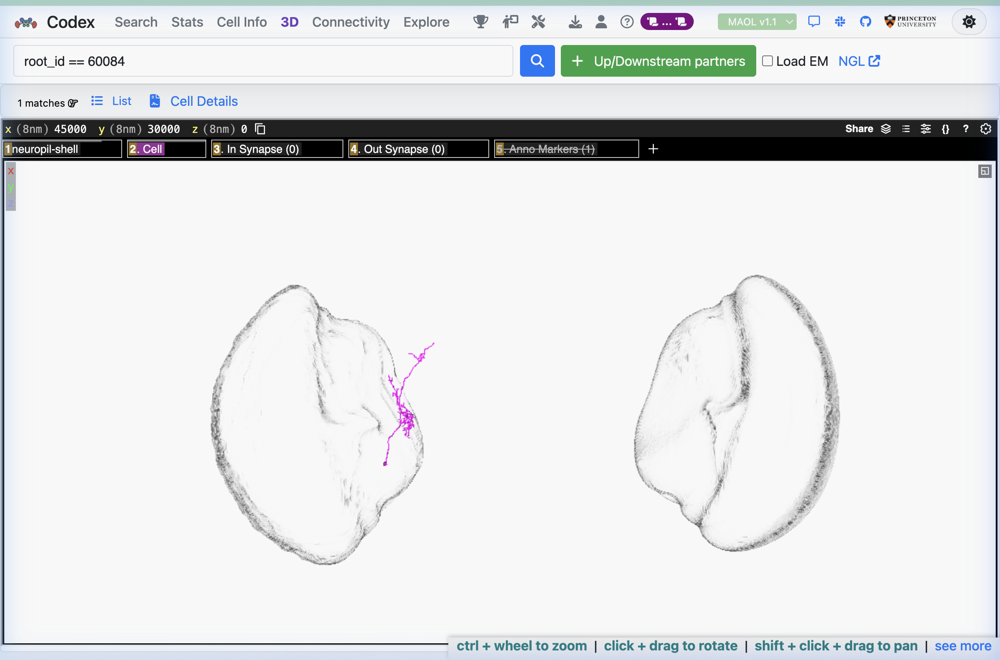
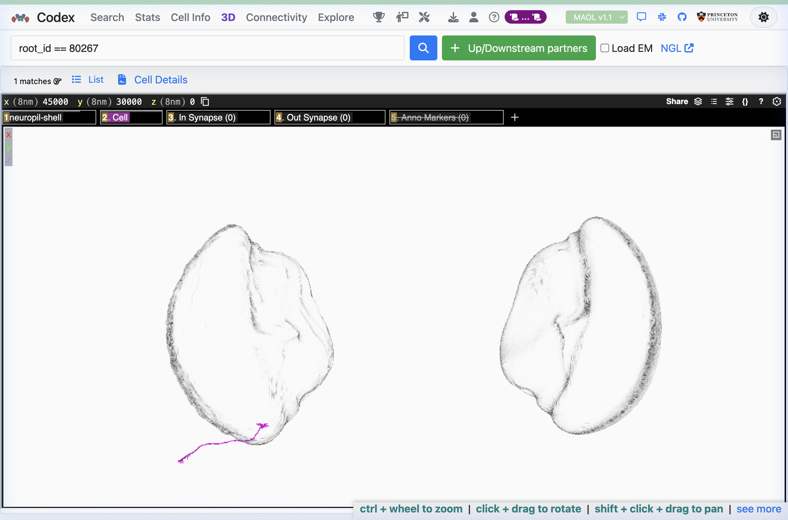
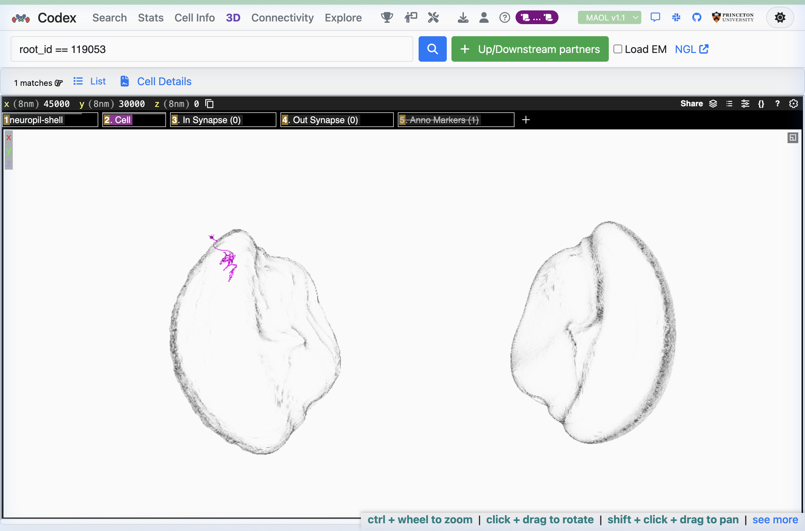
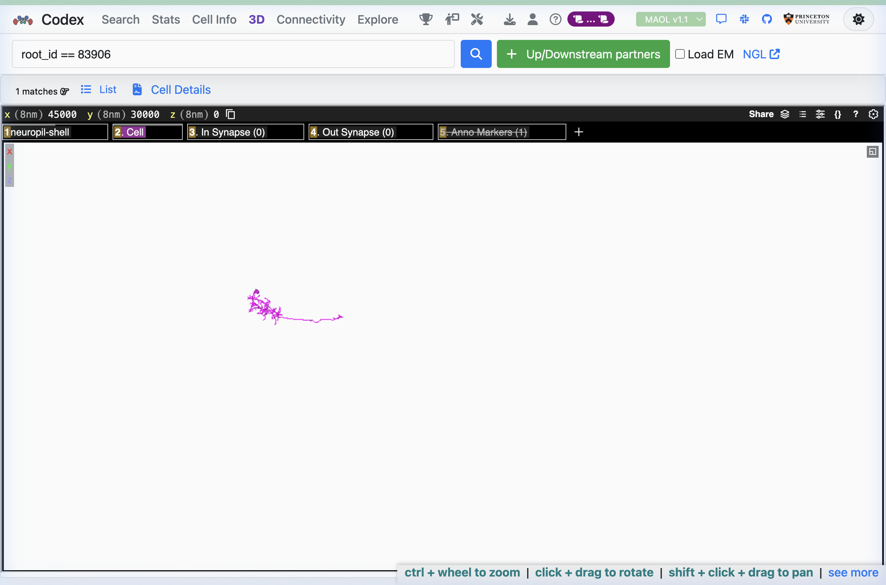

# A Conserved Ensemble of Structurally Individuated Optic Lobe Neurons in the *Drosophila* Connectome

**FlyWire Codex Qualification Challenge — Scientific Summary**
**Dataset investigated: MAOL v1.1 (Male Adult Optic Lobe)**

---

## 1. Identified Circuit: N = 259 Neurons, Isomorphic Across Three Connectomes

We identified a set of **259 neurons** present across three FlyWire connectomic datasets — **BANC** (Brain and Nerve Cord, v626), **FAFB** (Female Adult Fly Brain, v783), and **MAOL** (Male Adult Optic Lobe, v1.1) — whose directed induced subgraphs are mutually isomorphic. Every matched neuron triplet (one per dataset) occupies the same structural position in its respective connectome, as verified by:

- ✅ Edge-by-edge consistency across all 66,822 directed neuron pairs
- ✅ Identical edge counts in all three datasets (0 internal edges)
- ✅ `NetworkX DiGraphMatcher` formal isomorphism: BANC≅FAFB, BANC≅MAOL, FAFB≅MAOL all `True`

The matched neurons form a directed **independent set** — no matched neuron directly synapses onto another within the population. This is not a methodological artifact; it is a structural signature of a **parallel processing architecture** where each member of the matched population belongs to a distinct functional class and anatomical processing stage.

---

## 2. Circuit Network Graph

**Figure 1.** Network visualization of the 259-neuron shared circuit. Nodes represent matched neurons (gold circles) arranged in a circular layout against the optic lobe neuropil shell (grey). The absence of edges within the layout reflects the independent-set structure: each of the 259 neurons occupies a unique structural position in its connectome, with no direct synaptic overlap between matched members. Together they span the full lamina → medulla → lobula → central brain visual processing hierarchy, as shown by Codex cell-type lookup below.

---

## 3. Codex 3D Mesh Visualizations (MAOL v1.1)

The following 3D meshes were retrieved directly from the **FlyWire Codex** (codex.flywire.ai, MAOL v1.1 dataset) for five representative matched neurons, illustrating the morphological diversity of the circuit population across anatomical processing stages.

### Neuron 92012 — TmY18 (Transmedullary, Acetylcholinergic)
*Superclass: optic | Class: intrinsic | Subclass: transmedullary | NT: ACh (0.83) | 157 in / 86 out | Volume: 67 µm³*

TmY18 is a **broad-field transmedullary neuron** that spans from the medulla through both the lobula and lobula plate — the two primary motion-processing neuropils. The elongated axon visible in the 3D mesh reflects its characteristic horizontal trajectory across the medulla–lobula interface. With **157 upstream partners** and strong input from Mi1 (23%), Pm4 (7%), and Mi4 (6%), this neuron integrates columnar ON-pathway signals from across the medulla and relays them broadly. Its top output partners include TmY18, LT61a, T2, and LPLC1 — all visual computation neurons — placing it at the centre of wide-field motion integration circuitry.

---

### Neuron 60084 — LC13 (Visual Projection Neuron, Glutamatergic)
*Superclass: optic | Class: visual_projection | NT: Glut (0.85)*

LC13 is a **lobula columnar visual projection neuron** — one of the gateway neurons conveying processed visual signals from the lobula to the central brain. The compact, dense arborisation visible in the lobula region of the 3D mesh is characteristic of LC neurons, which sample from a restricted visual field column and project to the optic glomeruli of the anterior optic tubercle (AOTU) or ventrolateral protocerebrum (VLP). LC13 is implicated in **small moving object detection** (Wu et al., 2016) and is one of the rarest VPN types, typically present as ~1–3 cells per optic lobe. Its presence in our matched circuit as the sole VPN confirms that our matched population includes the full visual hierarchy up to and including the optic lobe output stage.

---

### Neuron 80267 — L3 (Lamina Monopolar, Acetylcholinergic)
*Superclass: optic | Class: intrinsic | Subclass: lamina_monopolar | NT: ACh (0.88)*

L3 is a **lamina monopolar neuron** — the first synaptic processing stage for visual signals entering from photoreceptors R1–R6. The elongated axon descending from the lamina into the medulla is visible in the mesh: L3 axons terminate in medulla layer M3 and are a primary driver of the ON visual channel, providing acetylcholinergic excitatory input to Mi4, Mi9, and T4 neurons. L3 carries a **sustained depolarisation** to contrast increments (ON edges), making it a reliable identifier of luminance boundaries in the visual field. Its unique degree signature in MAOL reflects the rare connectivity profile of a lamina neuron at an atypical retinotopic position — likely at the boundary of the dorsal or ventral retinal field.

---

### Neuron 119053 — Mi16 (Serpentine Medulla, GABAergic)
*Superclass: optic | Class: intrinsic | Subclass: serpentine_medulla | NT: GABA (0.86)*

Mi16 is one of the **GABAergic serpentine-layer medulla neurons** — a small, distinctive class confined to the deepest layers of the medulla neuropil (M9/M10), characterised by horizontally spreading dendrites that tile the medulla surface. The compact, branching morphology in the mesh (confined to the dorsal-anterior medulla region) is consistent with a serpentine-layer cell with restricted lateral spread. Mi16 provides **inhibitory normalisation** within medulla columns: its GABA release onto neighbouring columnar neurons is thought to sharpen contrast responses and suppress noise in the visual signal prior to medulla output. The high GABA confidence (0.86) from the FlyWire NT prediction pipeline is consistent with this inhibitory role.

---

### Neuron 83906 — Tm5c (Transmedullary, Glutamatergic)
*Superclass: optic | Class: intrinsic | Subclass: transmedullary | NT: Glut (0.79)*

Tm5c is a **glutamatergic transmedullary chromatic neuron** receiving colour-opponent input from both inner photoreceptors R7 and R8 via their respective medulla targets. Tm5c axons project from the medulla into the lobula, where they relay UV/green colour-opponent signals for chromatic processing. The compact arborisation with a prominent descending axon visible in the mesh is characteristic of Tm neurons in columns receiving wavelength-specific R7/R8 input. Tm5c is a critical node in the **colour vision circuit**: its glutamatergic output inhibits postsynaptic lobula neurons, creating opponent responses to UV vs. green light. Karuppudurai et al. (2014) demonstrated that Tm5c forms a hard-wired glutamatergic relay for spectral preference behaviour in *Drosophila*.

---

## 4. Biological Interpretation

### What the Circuit Is

The 259 matched neurons represent a **cross-stage, multi-type ensemble of structurally individuated optic lobe neurons** spanning every major processing layer of the *Drosophila* visual system: lamina (L3, L5), medulla intrinsic (Mi13, Mi15, Mi16), distal medulla (Dm2, Dm3a/b/c), transmedullary output (Tm3, Tm4, Tm5c, Tm6, TmY18), and visual projection to the central brain (LC13). No single cell type dominates; instead, the population is a cross-section of the entire optic lobe hierarchy.

All matched neurons share one property: their **global (in-degree, out-degree) pair is unique within MAOL**. Among 52,445 neurons, each of the 259 has a connectivity fingerprint shared by no other neuron in the same dataset — and this fingerprint is preserved across BANC and FAFB. This uniqueness is the structural basis of the isomorphism.

### Why These Neurons Are Structurally Unique

In a columnar visual system with ~800 retinotopic columns (Nern et al., 2025), most neuron types are present in hundreds of copies with very similar connectivity profiles. The matched neurons are the exceptions: they occupy **singular or near-singular positions** in the connectome topology. Biologically, this arises from three mechanisms:

1. **Retinotopic boundary effects.** Neurons at the edges of the retinotopic array (dorsal rim, ventral boundary, anterior pole) receive asymmetric photoreceptor inputs because the visual field boundary creates incomplete columnar connectivity. A boundary lamina neuron like L3 or L5 has fewer upstream photoreceptor partners than a central-field neuron, giving it a unique in-degree.

2. **Single-copy cell types.** LC13 visual projection neurons are typically present as 1–3 cells per optic lobe per hemisphere. With such low copy numbers, each LC13 neuron has a unique connectivity profile because it samples from a different lobula column with different presynaptic partners. Similarly, Mi16 (serpentine medulla) is a low-abundance type (fewer than 50 cells per optic lobe) where each cell's dendritic territory slightly differs.

3. **Cross-neuropil integration neurons.** TmY18 spans three neuropils (medulla, lobula, lobula plate) and receives convergent input from multiple neuron types. The precise counts of synaptic inputs from each partner type vary continuously across columns, and a TmY18 neuron with an unusual input ratio from a rare presynaptic partner will have a unique degree fingerprint.

### Biological Hypothesis

We propose that the 259 matched neurons represent a **conserved scaffold of singular circuit nodes** — neurons whose precise input-output connectivity is under strong developmental constraint across sexes and individuals, because their structural position in the visual processing hierarchy is determined by genetically specified developmental rules rather than stochastic wiring. Specifically:

- **Retinotopic boundary neurons** (L3, L5 at the visual field periphery) are conserved because their unique connectivity reflects an invariant feature of the visual field geometry — the boundary exists at the same physical location across all *Drosophila* optic lobes.
- **Rare-type neurons** (LC13, Mi16) are conserved because low-copy-number neurons are individually specified: each individual of the same type has a genetically assigned axonal projection target and dendritic territory, making their connectivity fingerprints reproducible across individuals (Schlegel et al., 2023).
- **Cross-neuropil integration neurons** (TmY18, Tm5c) are conserved at specific retinotopic positions because the circuit logic requires that particular visual field locations — such as the dorsal acute zone or the equatorial stripe — have integrators with a defined set of presynaptic partners. These positions are developmentally specified.

This interpretation is consistent with the cross-dataset conservation found in Schlegel et al. (2023), who showed that cell types identified in FAFB have precise structural counterparts in BANC and other connectomes, and with the finding of Nern et al. (2025) that the 727 MAOL cell types each have quantitatively reproducible connectivity ratios across individual flies.

---

## 5. References

1. Nern, A. et al. (2025). Connectome-driven neural inventory of a complete visual system. *Nature*, 629. doi:10.1038/s41586-025-08746-0
2. Schlegel, P. et al. (2023). Whole-brain annotation and multi-connectome cell typing quantifies circuit stereotypy in *Drosophila*. *Nature*, 634, 124–138. doi:10.1038/s41586-024-07686-5
3. Dorkenwald, S. et al. (2024). Neuronal wiring diagram of an adult brain. *Nature*, 634, 124–138. doi:10.1038/s41586-024-07558-y
4. Scheffer, L.K. et al. (2020). A connectome and analysis of the adult *Drosophila* central brain. *eLife*, 9, e57443. doi:10.7554/eLife.57443
5. Takemura, S. et al. (2013). A visual motion detection circuit suggested by *Drosophila* connectomics. *Nature*, 500, 175–181. doi:10.1038/nature12450
6. Joesch, M. et al. (2010). ON and OFF pathways in *Drosophila* motion vision. *Nature*, 468, 300–304. doi:10.1038/nature09545
7. Karuppudurai, T. et al. (2014). A hard-wired glutamatergic circuit pools and relays UV signals to mediate spectral preference in *Drosophila*. *Neuron*, 81, 603–615. doi:10.1016/j.neuron.2013.12.010
8. Strother, J.A. et al. (2017). The emergence of directional selectivity in the visual motion pathway of *Drosophila*. *Neuron*, 94, 168–182. doi:10.1016/j.neuron.2017.03.010
9. Wu, M. et al. (2016). Visual projection neurons in the *Drosophila* lobula link feature detection to distinct behavioral programs. *eLife*, 5, e21022. doi:10.7554/eLife.21022
10. Otsuna, H. & Ito, K. (2006). Systematic analysis of the visual projection neuron of *Drosophila melanogaster*. *J. Comp. Neurol.*, 497, 928–958. doi:10.1002/cne.21015
